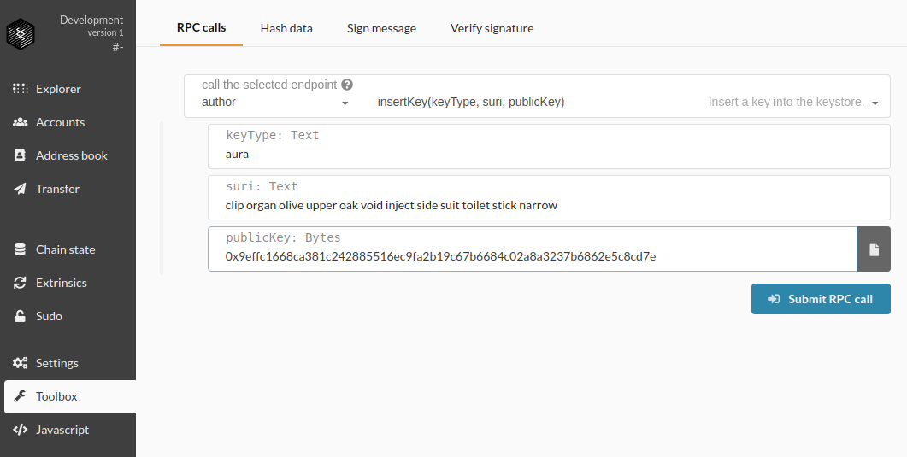
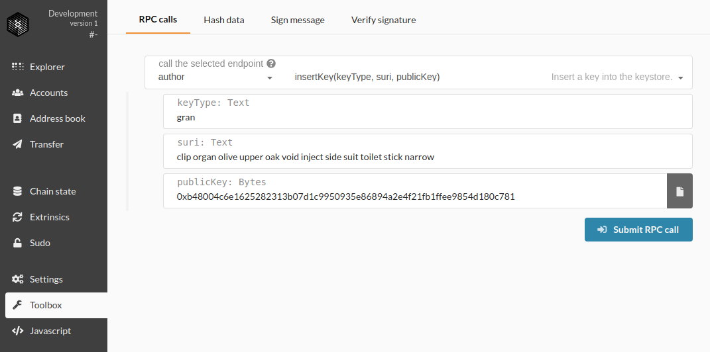

With you custom chain spec created and distributed to all participants, you're ready to launch your own custom chain. In this section it is no longer required to use a single physical machine or a single binary.

## First Participant Starts a Bootnode

You've completed all the necessary prep work and you're now ready to launch your chain. This
process is very similar to when you launched a chain earlier as Alice and Bob. It's important to
start with a clean base path, so if you plan to use the same path that you've used previously,
please delete all contents from that directory.

The first participant can launch her node with

```bash
./target/release/node-template \
  --base-path /tmp/node01 \
  --chain=./customSpecRaw.json \
  --port 30333 \
  --ws-port 9944 \
  --rpc-port 9933 \
  --telemetry-url 'ws://telemetry.polkadot.io:1024 0' \
  --validator \
  --name MyNode01
```
Here are some differences from when we launched as Alice.

* I've omitted the `--alice` flag. Instead we will insert our own custom keys into the keystore
through the RPC shortly.
* The `--chain` flag has changed to use our custom chain spec.
* I've added the optional `--name` flag. You may use it to give your node a human-readable name in the telemetry UI.

You should see the console outputs something as follows:

```bash
2020-04-16 15:57:26 Substrate Node
2020-04-16 15:57:26 ✌️  version 2.0.0-alpha.6-c1b33f8-x86_64-linux-gnu
2020-04-16 15:57:26 ❤️  by Anonymous, 2017-2020
2020-04-16 15:57:26 📋 Chain specification: Local Testnet
2020-04-16 15:57:26 🏷  Node name: MyNode01
2020-04-16 15:57:26 👤 Role: AUTHORITY
2020-04-16 15:57:26 ⛓  Native runtime: node-template-1:1(node-template-1)
2020-04-16 15:57:26 🔨 Initializing Genesis block/state (state: 0xb132…57f2, header-hash: 0xf437…e7fe)
2020-04-16 15:57:26 👴 Loading GRANDPA authority set from genesis on what appears to be first startup.
2020-04-16 15:57:26 ⏱ Loaded block-time = 6000 milliseconds from genesis on first-launch
2020-04-16 15:57:26 📦 Highest known block at #0
2020-04-16 15:57:26 Using default protocol ID "sup" because none is configured in the chain specs
2020-04-16 15:57:26 🏷  Local node identity is: QmUD77u76tnzKvvEDiLNgJ8iGkuxe6cjDbLB221oXWxD1Z
2020-04-16 15:57:26 〽️ Prometheus server started at 127.0.0.1:9615
2020-04-16 15:57:31 💤 Idle (0 peers), best: #0 (0xf437…e7fe), finalized #0 (0xf437…e7fe), ⬇ 0 ⬆ 0
2020-04-16 15:57:36 💤 Idle (0 peers), best: #0 (0xf437…e7fe), finalized #0 (0xf437…e7fe), ⬇ 0 ⬆ 0
2020-04-16 15:57:41 💤 Idle (0 peers), best: #0 (0xf437…e7fe), finalized #0 (0xf437…e7fe), ⬇ 0 ⬆ 0

```

## Add Keys to Keystore

Once your node is running, you will again notice that no blocks are being produced. At this point,
you need to add your keys into the keystore. Remember you will need to complete these steps for each node in your network.

### Option 1: Using Polkadot-JS App UI

You can use the Apps UI to insert your keys into the keystore. Navigate to the "Toolbox" tab and the "RPC Call" sub-tab. Choose "author" and "insertKey". The fields can be filled like this:



```
keytype: aura
suri: <your mnemonic phrase> (eg. clip organ olive upper oak void inject side suit toilet stick narrow)
publicKey: <your raw sr25519 key> (eg. 0x9effc1668ca381c242885516ec9fa2b19c67b6684c02a8a3237b6862e5c8cd7e)
```
> If you generated your keys with the Apps UI you will not know your raw public key. In this case you may use your SS58 address (`5FfBQ3kwXrbdyoqLPvcXRp7ikWydXawpNs2Ceu3WwFdhZ8W4`) instead.

You've now successfully inserted your **aura** key. You can repeat those steps to insert your **grandpa** key (the **ed25519** key)



```
keytype: gran
suri: <your mnemonic phrase> (eg. clip organ olive upper oak void inject side suit toilet stick narrow)
publicKey: <your raw ed25519 key> (eg. 0xb48004c6e1625282313b07d1c9950935e86894a2e4f21fb1ffee9854d180c781)
```
> If you generated your keys with the Apps UI you will not know your raw public key. In this case you may use your SS58 address (`5G9NWJ5P9uk7am24yCKeLZJqXWW6hjuMyRJDmw4ofqxG8Js2`) instead.

> If you are following these steps for the _second_ node in the network, you must connect the UI to the second node before inserting the keys.

### Option 2: Using CLI

You can also insert a key to the keystore by command line.

```bash
# Submit a new key via RPC, connect to where your `rpc-port` is listening
$ curl http://localhost:9933 -H "Content-Type:application/json;charset=utf-8" -d \
  '{
    "jsonrpc":"2.0",
    "id":1,
    "method":"author_insertKey",
    "params": [
      "<aura/gran>",
      "<mnemonic phrase>",
      "<public key>"
    ]
  }'
```

If you enter the command and parameters correctly, the node will return a JSON response as follows.

```json
{ "jsonrpc": "2.0", "result": null, "id": 1 }
```

## Subsequent Participants Join

Subsequent validators can now join the network. This can be done by specifying the
`--bootnodes` paramter as Bob did previously.

```bash
./target/release/node-template \
  --base-path /tmp/node02 \
  --chain ./customSpecRaw.json \
  --port 30334 \
  --ws-port 9945 \
  --rpc-port 9934 \
  --telemetry-url 'ws://telemetry.polkadot.io:1024 0' \
  --validator \
  --name MyNode02 \
  --bootnodes /ip4/<IP Address>/tcp/<Port>/p2p/<Peer ID>
```

As before, we specify another `base-path`, give it another `name`, and also specify this node as a
`validator`.

Once the node is up, you're ready to add keys to its keystore by following the process (in the previous section) just like you did for the first node.

> If you're inserting keys with the UI, you must connect the UI to the second node's WebSocket endpoint before inserting the second node's keys.

> Reminder: All validators must be using identical chain specifications in order to peer. You
> should see the same genesis block and state root hashes.

Once both nodes have their keys, you should see them authoring

```
...
2020-04-16 16:00:12 💤 Idle (1 peers), best: #0 (0xf437…e7fe), finalized #0 (0xf437…e7fe), ⬇ 0 ⬆ 0
2020-04-16 16:00:17 💤 Idle (1 peers), best: #0 (0xf437…e7fe), finalized #0 (0xf437…e7fe), ⬇ 0.2kiB/s ⬆ 0.2kiB/s
2020-04-16 16:00:22 💤 Idle (1 peers), best: #0 (0xf437…e7fe), finalized #0 (0xf437…e7fe), ⬇ 0 ⬆ 0
2020-04-16 16:00:24 ✨ Imported #1 (0x5987…be47)
2020-04-16 16:00:27 💤 Idle (1 peers), best: #1 (0x5987…be47), finalized #0 (0xf437…e7fe), ⬇ 0.1kiB/s ⬆ 56 B/s
2020-04-16 16:00:32 💤 Idle (1 peers), best: #1 (0x5987…be47), finalized #0 (0xf437…e7fe), ⬇ 0.2kiB/s ⬆ 0.2kiB/s
2020-04-16 16:00:36 ✨ Imported #2 (0x6c69…5f47)
2020-04-16 16:00:37 💤 Idle (1 peers), best: #2 (0x6c69…5f47), finalized #0 (0xf437…e7fe), ⬇ 98 B/s ⬆ 60 B/s

...
```

This line shows that your node has peered with another (**`1 peers`**), and they have produced a block
(**`best: #1 (0x5987…be47)`**).

You may notice that no block finalization has happened yet (**`finalized #0 (0xf437…e7fe)`**). Substrate nodes require a restart after inserting a grandpa key. Kill your nodes and restart them with the same commands you used previously. Now blocks should be finalized.

## You're Finished

Congratulations! You've started your own blockchain!

In this tutorial you've learned to generate your own keypairs, create a
custom chain spec that uses those keypairs, and start a private network based on your custom chain
spec.

<!-- TODO link to the followup tutorial about starting a 3 node network using the demo substrate node
Details in https://github.com/substrate-developer-hub/tutorials/issues/16-->

### Learn More

That big Wasm blob we encountered in the chain spec was was necessary to enable forkless upgrades.
Learn more about how the [executor](/kb/advanced/executor) uses on-chain Wasm.
